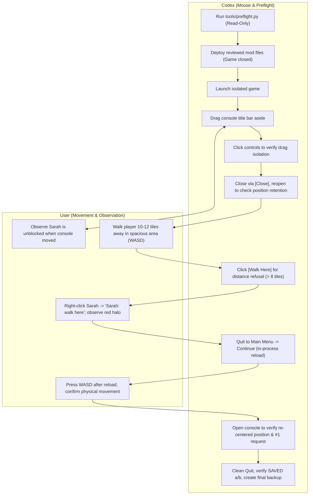

# Consolidated M1 Native Acceptance Session Plan

Updated: 2026-10-05 (Europe/Helsinki).
Status: **IN PROGRESS** in the backed-up isolated sandbox; see current results below.
Offline verification: **202 automated checks pass across 7 suites** (`tools/run_tests.py`), **11 runner self-tests pass** (`tools/test_runner.py`), and **19 preflight tests pass** (`tools/test_preflight.py`).

> [!IMPORTANT]
> **Notice**: Partial native results are recorded below; remaining gates are not yet accepted. This document consolidates all outstanding M1 items into a single, cohesive, ordered session plan. Bounded manual follow-player behavior has also been implemented and hardened offline (46 checks in `tools/test_follow.py` and 36 checks in `tools/test_console.py`) with partial native follow results recorded below. Completing acceptance in a single game process launch is an operational goal conditional on having the spacious test case prepared in advance, rather than an unconditional guarantee.

---

## 1. Scope, Purpose, and Policy Boundaries

### 1.1 Objective
Prepare a single consolidated native test session for Codex and the user covering all remaining M1 implementation gates:
1. **Movable console panel**: Title-bar mouse dragging, moving panel aside to unblock view of Sarah.
2. **Control click isolation**: Clicks on buttons, text entry, `Close`, `Run`, and history never initiate dragging or duplicate commands.
3. **In-session position retention**: Preserving moved position across panel close and reopen within the same world session.
4. **Resolution adaptation and recovery**: Non-negative title bar clamp (`minY = 0`), layout adaptation on small/resized screens, drag handle restart, and full control reachability.
5. **Distance refusal via mouse button**: `[Walk Here]` refusal when player is > 8 tiles away on the same floor.
6. **Red context-menu refusal feedback**: Right-click Sarah -> `Sarah: walk here` visible red halo refusal when > 8 tiles away.
7. **Post-reload user movement**: Confirmation of physical character movement (WASD) after `Quit to Main Menu` -> `Continue`.
8. **Session reset to centered default**: Resetting console position to default centered coordinates on world reload.

### 1.2 Safeguards and Policy
- **External AI**: Strictly **ON HOLD** by explicit user instruction. No AI models, dialogue services, or background daemons are authorized.
- **Environment isolation**: Test exclusively in the isolated profile at `G:/Codex/Project Sarah/runtime/isolated`. Normal saves, vanilla configuration files, and installed game files (`G:/Games/ProjectZomboid/`) remain read-only and untouched.
- **Single-writer ownership**: Codex owns live test execution and game launches; Gemini handles bounded offline coding and tooling only.
- **Read-only preflight**: Codex runs `tools/preflight.py` to verify environment readiness before deploying or launching.

---

## 2. Evidence Reconciliation: Accepted vs Remaining Gates

### 2.1 Already Accepted Native Gates (Do Not Repeat Without Regression)
The following gates have been accepted with live evidence in isolated test sessions. They do not require re-verification unless investigating a suspected regression:

| Gate | Category | Description | Evidence / Process ID | Status |
|---|---|---|---|---|
| **A1** | Input | Physical F9 hold-repeat (held key leaves console open) | User-operated; PID 36520 / PID 41784 | **PASSED** |
| **A2** | Input | Movement restoration after Escape or mouse Close | User confirmed WASD movement fine; PID 36520 | **PASSED** |
| **A3** | UI | English Options key-binding labels (`[Project Sarah]`, `Sarah Console`) | Visual screenshot inspection; PID 36520 | **PASSED** |
| **A4** | Config | Key rebinding to F7 and persistence across full restart | Saved in `Lua/keysB42.ini`, old F9 inactive; PID 41784 | **PASSED** |
| **A5** | Input | Conflict refusal & context menu fallback (W binding refused with notice) | World right-click `Sarah: console` opens panel; PID 41784 | **PASSED** |
| **A6** | Teardown | Same-process menu teardown & world reload without orphans | Quit to Main Menu -> Continue; PID 41784 | **PASSED** |
| **B1** | Commands | Idle `stop` command and repeated `stop` | Completed with `Sarah stopped; nothing active.`; checkpoint `70eee10` | **PASSED** |
| **B2** | History | Status and bounded history retention across F9 close/reopen | History #7 retained requests #1-#6; checkpoint `70eee10` | **PASSED** |
| **C1** | Movement | Nearby walk arrival via mouse shortcut `[Walk Here]` | User confirmed physical movement and arrival; walk #18; PID `12b20a6` | **PASSED** |
| **C2** | Movement | Already-at-target detection via mouse shortcut `[Walk Here]` | Immediate `Already at target (...)` completion without movement; PID `12b20a6` | **PASSED** |
| **C3** | Cancellation | Live movement cancellation via `[Stop]` button | User confirmed walk #18 halted mid-stride by stop #19; PID `12b20a6` | **PASSED** |
| **C4** | Resumption | Immediate walk resumption following mid-stride cancellation | Subsequent walk completed to new player square; PID `12b20a6` | **PASSED** |
| **C5** | Context Menu | Context menu `Sarah: walk here` arrival with green halo feedback | Walk #23 completed at (10768, 10272, 0), history #24; PID `12b20a6` | **PASSED** |
| **C6** | Reset | Same-process session reset clears command history | Log showed `SESSION_RESET`, Help restarted at #1; PID `12b20a6` | **PASSED** |

### 2.2 Remaining Native Gates (Target of this Batched Session)
The following 8 items remain pending native live acceptance:

| Gate | Target Feature | Specific Acceptance Criterion | Execution Actor |
|---|---|---|---|
| **R1** | Movable Console | Dragging title bar moves console smoothly aside; reveals Sarah in world | Codex (Mouse drag) |
| **R2** | Control Isolation | Clicks on controls/buttons never start drag, alter pos, or duplicate commands | Codex (Mouse clicks) |
| **R3** | Position Retention | Console close/reopen within same session reopens at chosen moved position | Codex (Mouse Close/Reopen) |
| **R4** | Resolution Robustness | On small screen / window resize, height adapts, `y >= 0` clamped, controls reachable | Codex (Mouse / Window) |
| **R5** | Distance Refusal (Button) | `[Walk Here]` with player > 8 tiles away outputs `Target is too far (...)` `#<id> rejected` | User moves > 8 tiles, Codex clicks |
| **R6** | Distance Refusal (Menu) | Right-click `Sarah: walk here` > 8 tiles shows visible red halo refusal text | User right-clicks Sarah |
| **R7** | Post-Reload Movement | Physical character movement (WASD) verified working after Continue | User operates WASD |
| **R8** | Center Reset on Reload | Console reopens at default centered position after world reload (`pos = nil`) | Codex opens console |

### 2.3 Post-M1 Follow Feature Smoke Checks (Follow Status & Asynchronous Feedback)
These checks cover the newly implemented offline manual companion behavior and user-facing feedback without affecting M1 baseline gates R1–R8:

| Gate | Target Feature | Specific Acceptance Criterion | Execution Actor |
|---|---|---|---|
| **F1** | Follow Status: Walking | While walking toward player, `[Status]` outputs `Follow: following while walking to (x, y, z)` | Codex clicks `[Status]` while Sarah walks |
| **F2** | Follow Status: In Range / Before Next Walk | During cooldown, `[Status]` outputs `Follow: follow engaged but waiting within range` if player is within 2-tile deadzone; otherwise `Follow: follow engaged but waiting before next walk` | Codex clicks `[Status]` with player in / out of deadzone |
| **F3** | Follow Status: Disengaged | After leash break / disengagement, `[Status]` outputs `Follow: disengaged (<reason>)` | Codex clicks `[Status]` after disengagement |
| **F4** | Stop Failure Warning & Recovery | If engine stop fails during disengagement or user stop, `[Status]` warns `Warning: engine stop failed (<reason>); movement blocked pending recovery.` and movement is rejected until successful `[Stop]` clears failure | Codex inspects status if stop fails; verifies recovery |
| **F5** | Asynchronous Disengagement Feedback | Leash break (> 8 tiles) immediately outputs `Follow disengaged: player out of range (>8 tiles).` to open panel and triggers in-world halo text without manual polling | User walks > 8 tiles while following; Codex/User observes feedback |
| **F6** | Closed-Console Feedback & No Replay | Disengagement while console is closed displays in-world halo text; subsequent console opening starts clean without replaying notices | User closes console, triggers disengagement, reopens console |

---

## 3. Spacious Disposable Case: `SarahSpaciousCase`

### 3.1 Problem Diagnosis from Session `12b20a6`
In checkpoint `12b20a6`, distance refusal checks were skipped because the test character was located inside a small residential house where rooms measured under 5x5 tiles. The user explicitly declined stepping outside into unexplored outdoors due to zombie infection hazards and lack of safe visibility.

### 3.2 Space and Safety Requirements
- **Floor level**: Flat, same floor (`z = 0`).
- **Distance**: At least **10–12 clear tiles** in a straight line between the player and Sarah without doors, walls, or solid obstacles.
- **Safety**: Fully safe environment without zombie attack or infection risk. Outdoor testing was explicitly declined by the user.

### 3.3 Proposed Approach: Fresh Isolated Zero-Zombie Sandbox
To eliminate all zombie hazards without relying on dangerous outdoor exploration or unverified interior clearances:
1. **Zero-Zombie Sandbox Creation**:
   - In the isolated profile, create a fresh disposable custom sandbox world configured with **zero zombies** (Zombie Population / Count = "None" / `Zombies=1` in PZ sandbox settings).
   - In a zero-zombie environment, character death and infection risks are completely eliminated.
2. **Building Dimensions & Interior Safety (Unverified)**:
   - Specific building dimensions (e.g. Rosewood Fire Station apparatus bay estimated at ~14x10 open tiles on `z = 0`, Church nave ~16x8, high school gymnasium ~20x15) and interior safety in normal survival saves are **unverified estimates**; their actual clear tile dimensions and obstacle layout have not been confirmed in-engine.
   - In a standard survival save, these locations cannot be presumed safe or cleared. In a zero-zombie sandbox, however, spacious indoor facilities (or even open paved parking lots / street spans) can be navigated with complete safety.
3. **Case Setup (`SarahSpaciousCase`)**:
   - Position Sarah and the player standing 3 tiles apart in the open flat area on floor 0.
   - Save cleanly via pause menu and quit to desktop (`SAVED a` or `b`).
   - Copy the save directory to `runtime/isolated/Saves/Rising/SarahSpaciousCase`.
   - Update `runtime/isolated/latestSave.ini` to select `SarahSpaciousCase`.
   - Ensure baseline backup includes this prepared case before starting the batched session.

---

## 4. Division of Responsibilities

To prevent keyboard injection failures and minimize manual user workload, operations are partitioned strictly:



---

## 5. Ordered Batched Acceptance Protocol

Executing the following steps in sequence has the goal of completing acceptance in **1 game process launch** (conditional on having `SarahSpaciousCase` prepared and selected beforehand), **1 in-process reload**, and **2 user movement phases**:

### Phase 0: Preflight and Pre-Test Backup (Game Closed)
1. Ensure Project Zomboid is closed (`javaw.exe` / `java.exe` absent).
2. Run project preflight tool:
   ```powershell
   $sarahPython = 'C:\Users\rudol\.cache\codex-runtimes\codex-primary-runtime\dependencies\python\python.exe'
   & $sarahPython tools/preflight.py --no-strict
   ```
3. Inspect `tools/reports/preflight-report.json`. Notice file differences (e.g. `Console.lua` needs deployment).
4. Create fresh timestamped pre-test backup directory:
   - Target: `runtime/backups/batched-acceptance-<timestamp>/`
   - Copy: `runtime/isolated/Saves/Rising/SarahSpaciousCase` (or `SarahConsoleNativeCase`), `runtime/isolated/Lua/keysB42.ini`, `runtime/isolated/options.ini`, `runtime/isolated/latestSave.ini`, and `runtime/isolated/mods/SarahFoundation/`.
5. Deploy reviewed production files from `foundation/SarahFoundation/` into `runtime/isolated/mods/SarahFoundation/`:
   - `42/media/lua/client/SarahFoundation.lua`
   - `42/media/lua/client/Sarah/Commands.lua`
   - `42/media/lua/client/Sarah/Console.lua`
   - `42/media/lua/client/Sarah/Engine.lua`
   - `42/media/lua/client/Sarah/Lifecycle.lua`
   - `42/media/lua/client/Sarah/Observations.lua`
   - `42/media/lua/shared/Translate/EN/UI.json`
   - `42/mod.info`
   - `README.md`
6. Rerun preflight:
   ```powershell
   & $sarahPython tools/preflight.py
   ```
   Verify exit code 0 (`OVERALL PREFLIGHT: READY FOR NATIVE ACCEPTANCE`).

---

### Phase 1: Game Launch
1. Launch isolated game (`tools/launch-isolated.ps1` or native launcher).
2. On main menu, select **Continue** (loading `SarahSpaciousCase` or `SarahConsoleNativeCase`).
3. Confirm clean load: log records `RESTORED a` or `b`, `ACTIVE npc=true`, player and Sarah present on same floor.

---

### Phase 2: Movable Console & Control Isolation (Codex Mouse)
1. **Open Console**: Right-click game world -> `Sarah: console` (or press F9).
   - Console opens in default centered position (`x ≈ 360, y ≈ 175` on 1280x720).
2. **Gate R1 (Title Bar Dragging)**:
   - Grab the title bar ("Sarah Console" text area) and drag the panel to the upper-right or side of the screen.
   - Release mouse. Verify panel remains at moved position (`x, y` updated).
   - *User confirmation*: Sarah and player in the world scene are now clearly visible and unobstructed by the console.
3. **Gate R2 (Control Isolation)**:
   - While console is in the moved position, click `[Status]` button:
     - Verify command executes cleanly (`> status`, `Action: idle`).
     - Verify panel coordinates do **NOT** change and panel does **NOT** start moving.
   - Click `[History]` button:
     - Verify history displays recent actions without panel movement.
   - Click inside the text entry box:
     - Verify entry box receives focus; panel does not drag.
   - Click `[Help]` button:
     - Verify output appends cleanly; no duplicate command fired.
4. **Gate R3 (In-Session Position Retention)**:
   - Click `[Close]` button on top-right of panel.
   - Verify console closes cleanly without opening pause menu.
   - Reopen console via right-click world -> `Sarah: console` (or F9).
   - **Verification**: Console opens at the exact moved position chosen in Step 2 (retaining `state.pos`).

---

### Phase 3: Resolution & Small-Screen Adaptation (Codex / Window)
*(If testing in windowed mode or testing window resize)*:
1. **Gate R4 (Small-Screen Adaptation)**:
   - Resize game window to small dimensions (e.g. 800x600 or 500x300):
     - Verify console height dynamically adapts: history listbox scales, toolbar buttons adjust, text entry and `[Run]` adjust.
     - Verify top title bar remains strictly on screen (`y >= 0`) and never slides above screen top.
     - Verify `[Close]` button and command buttons remain reachable.
     - Click and drag title bar: verify drag restart functions smoothly after mouse release.
   - Restore standard window resolution (e.g. 1280x720 or 1920x1080):
     - Verify console height expands back to standard 370px layout.

---

### Phase 4: Distance Refusal Checks (User + Codex)
1. **User Repositioning**:
   - User moves player character across the open floor space using WASD until the player is **10–12 tiles away** from Sarah on the same floor (`z = 0`).
2. **Gate R5 (Distance Refusal via Button)**:
   - Codex clicks `[Walk Here]` button on the console panel.
   - **Expected output**:
     - Console prints `> walk here`.
     - Output line: `Target is too far (maximum 8 tiles).`
     - Status line: `#<id> rejected`.
     - Sarah remains stationary in the world (no movement initiated).
   - Codex clicks `[Status]`: outputs `Action: idle`.
3. **Gate R6 (Red Context-Menu Refusal Feedback)**:
   - While still standing 10–12 tiles away, user right-clicks Sarah in the world scene to open the context menu.
   - User selects `Sarah: walk here`.
   - **Expected feedback**:
     - Player displays red/bad halo text: `Target is too far (maximum 8 tiles).`.
     - Sarah remains stationary.
   - Codex clicks `[History]`: confirms refusal is logged in dispatch history.

---

### Phase 5: Same-Process Reload & Session Reset
1. **Exit to Main Menu**:
   - Press Escape (or pause menu) -> select **Exit to Main Menu**.
   - Verify game returns to main menu cleanly without orphaned UI panels.
2. **Continue World**:
   - On main menu, click **Continue**.
   - Log records `SESSION_RESET`, `RESTORED a` or `b`, `ACTIVE npc=true`.
3. **Gate R7 (Post-Reload User Movement)**:
   - User presses WASD movement keys immediately upon reload.
   - **Verification**: Player character walks smoothly; no input freeze, key lock, or camera disruption.
4. **Gate R8 (Center Reset on World Reload)**:
   - Codex opens Sarah Console via right-click world -> `Sarah: console` (or F9).
   - **Verification**:
     - Console opens in the **default centered position** (`state.pos = nil` verified; does not retain previous session's moved coordinate).
     - Codex clicks `[Help]`: output begins at request **`#1 help: completed`** (request sequence counter cleanly reset to #1).
     - Codex clicks `[History]`: history contains only `#1 help: completed` and `#2 history: completed` (pre-reload command history cleanly cleared).

---

### Phase 6: Post-M1 Follow Status & Feedback Smoke Checks (Optional / Non-Blocking)
*Note: These steps verify follow companion status distinctions and asynchronous feedback if tested within the same live session. Failure of these steps does not invalidate M1 gates R1–R8.*

1. **Gate F1 & F2 (Follow Status: Walking vs In-Range Waiting vs Before Next Walk)**:
   - Codex clicks `[Follow]` while player is 4–6 tiles away from Sarah on the same floor.
   - While Sarah is walking, Codex clicks `[Status]`:
     - **Verification**: Status displays `Action: #<id> follow (running)` and `Follow: following while walking to (x, y, z)`.
   - Sarah reaches within 2 tiles of player and halts. Codex clicks `[Status]`:
     - **Verification**: Status displays `Action: #<id> follow (running)` and `Follow: follow engaged but waiting within range`.
   - If player steps > 2 tiles away during step cooldown before next walk dispatch, Codex clicks `[Status]`:
     - **Verification**: Status displays `Follow: follow engaged but waiting before next walk`.

2. **Gate F5 & F3 (Asynchronous Leash Break Feedback & Disengaged Status)**:
   - With console open and follow active, user walks rapidly > 8 tiles away.
   - **Verification**:
     - Without typing or clicking, console panel history immediately receives `Follow disengaged: player out of range (>8 tiles).` and `#<id> cancelled`.
     - In-world red halo text floats above the player (`Follow disengaged: player out of range (>8 tiles).`).
     - Codex clicks `[Status]`: outputs `Action: idle (last: #<id> cancelled)` and `Follow: disengaged (player out of range (>8 tiles))`.

3. **Gate F6 (Closed-Console Disengagement & Clean Reopen)**:
   - User re-engages follow via `[Follow]`, then closes the console via mouse `[Close]` or F9.
   - User walks > 8 tiles away to trigger leash break while console is closed.
   - **Verification**:
     - In-world red halo text floats above the player (`Follow disengaged: player out of range (>8 tiles).`).
     - Codex opens Sarah Console via context menu or F9.
     - Console opens clean: no replayed notification messages, no spurious command execution.
     - Codex clicks `[Status]`: accurately reflects `Follow: disengaged (player out of range (>8 tiles))`.

4. **Gate F4 (Stop Failure Warning & Recovery)**:
   - If an engine stop fails during disengagement or user stop, `[Status]` outputs `Warning: engine stop failed (<reason>); movement blocked pending recovery.`
   - Subsequent `[Follow]` or `[Walk Here]` requests are rejected while movement is blocked.
   - Clicking `[Stop]` clears the failure and confirms `Prior engine stop failure cleared; movement recovered.` and `Sarah stopped; nothing active.`

---

### Phase 7: Clean Shutdown & Evidence Preservation
1. Open pause menu -> select **Quit to Desktop**.
2. Verify clean shutdown in game log:
   - `SAVED a` or `SAVED b`
   - `GameThread exited`
   - No lingering `javaw.exe` or `java.exe` processes.
3. Preserve final world case, settings, and console log into `runtime/backups/batched-acceptance-<timestamp>/Final-native/`.
4. Rerun preflight tool to record post-test state:
   ```powershell
   & $sarahPython tools/preflight.py --no-strict
   ```

---

## 6. Exact Evidence Requirements

For acceptance sign-off, record the following concrete evidence items in `evidence/batched-acceptance-summary.txt`:

1. **Gate R1 & R2 (Movable & Isolated)**:
   - Moved panel coordinates (`x, y`).
   - Confirmation that clicks on `[Status]`, `[History]`, `[Help]`, `[Close]`, and entry box did not move panel.
2. **Gate R3 (Position Retention)**:
   - Reopened panel coordinates matching moved coordinates.
3. **Gate R4 (Resolution Adaptation)**:
   - Adapted height and non-negative `y` coordinate under window resize.
4. **Gate R5 (Distance Refusal via Button)**:
   - Observed player coordinates `(px, py, pz)` and NPC coordinates `(nx, ny, nz)` where `(px-nx)^2 + (py-ny)^2 > 64`.
   - Exact console output: `Target is too far (maximum 8 tiles).` and `#<id> rejected`.
5. **Gate R6 (Red Context-Menu Feedback)**:
   - Confirmation of red halo text display on player character upon context menu click.
6. **Gate R7 (Post-Reload Movement)**:
   - User confirmation that physical WASD movement was functional after `Continue`.
7. **Gate R8 (Session Reset)**:
   - Log snippet showing `SESSION_RESET` and `RESTORED`.
   - Console output showing request `#1 help: completed` and clean history reset.
8. **Process & Log Verification**:
   - Process PID and clean exit evidence (`SAVED a` / `b`, `GameThread exited`).
9. **Gates F1–F6 (Follow Status & Asynchronous Feedback - Post-M1 Smoke Checks)**:
   - Console status lines showing `following while walking`, `waiting within range`, and `disengaged (<reason>)`.
   - Observation of automatic console history append and in-world halo text on leash break without manual polling.
   - Confirmation of clean reopen without notice replay.

---

## 7. Rollback and Recovery Protocol

If any test step fails or requires repetition:
1. **Close game process** completely (`Stop-Process -Name javaw -Force` if hanging).
2. **Restore baseline save**:
   ```powershell
   Copy-Item -Path "runtime/backups/slice-c-native-20261005-143139/Final-native/SarahConsoleNativeCase" -Destination "runtime/isolated/Saves/Rising/SarahConsoleNativeCase" -Recurse -Force
   ```
3. **Restore baseline settings**:
   ```powershell
   Copy-Item -Path "runtime/backups/slice-c-native-20261005-143139/Final-native/keysB42.ini" -Destination "runtime/isolated/Lua/keysB42.ini" -Force
   ```
4. **Restore baseline mod files**:
   ```powershell
   Copy-Item -Path "runtime/backups/slice-c-native-20261005-143139/Previous-mod/*" -Destination "runtime/isolated/mods/SarahFoundation/" -Recurse -Force
   ```
5. Re-run `tools/preflight.py` to verify restored baseline state before repeating tests.

## Current native results (Codex and user, 2026-10-05)

Source baseline: 5fa6b9c. Case: Sandbox/2026-10-05_19-04-21.
Evidence: evidence/batched-follow-native.txt; backup: runtime/backups/batched-follow-20261005-190349/Prepared-spacious.

- R1 PASS, physical user title drag; automated drag did not move the panel.
- R3 PASS, moved position retained across mouse Close/context-menu reopen.
- R5 PASS, button refused a target beyond 8 tiles.
- R6 PASS, visible red context-menu distance refusal.
- R2 partial: tested mouse controls preserved position; full control coverage remains pending.
- R4, R7 and R8 pending in this batch.
- Native follow movement PASS by user observation; initial catch-up and in-range waiting also observed by Codex.
- F2 partial: in-range waiting observed; out-of-range cooldown distinction pending.
- F3 PASS: Status showed disengaged (player out of range (>8 tiles)), action idle.
- Follow mid-stride Stop and no automatic resumption PASS by user report; no independent screenshot of transition.
- F1, F4, F5 and F6 remain unverified natively. Do not induce an engine stop failure solely for this test.
- User noted slow tracking; responsiveness concern retained for later refinement, no source adjustment.

Native F6 PASS (Codex visual inspection, 2026-10-05): after user ran beyond leash with console closed, screenshot showed red in-world Follow disengaged: player out of range (>8 tiles). Game paused with message visible. Resumed normally; halo expired. Context-menu console reopen displayed only initial command/binding headers, no replayed notice or automatic command. Moved panel position retained. Game running, console open; Follow cancelled. F5 open-panel delivery remains pending, F6 closed-panel feedback/no-replay accepted.

Same-process reload native check (Codex, 2026-10-05): Quit to main menu then Continue reloaded isolated sandbox; SESSION_RESET seen in local log. Console reopened centered at approximately (361,206), instead of retained (53,187): R8 PASS. Clean headers with no stale notice; Status restarted at #1 and reported Sarah active / Action idle, player (8268.49,11680.46,0), NPC (8279.50,11679.50,0). No follow restored. Console closed for user WASD check; R7 pending user reply. Game running; Codex owns checkout.

R7 PASS (user-operated, 2026-10-05): user confirmed WASD works after same-process Quit/Continue and mouse console Close. R8 centered reset and idle follow state independently observed before this reply. Remaining batch gates: R2 full control isolation coverage, R4 resolution adaptation, F1 walking status, F2 out-of-range cooldown wording, F5 open-console automatic notice; F4 stop failure remains offline-only unless naturally encountered. F6 accepted. Game remains running, no source changes; Codex retains ownership. Final game-closed snapshot still pending.

User typed status then clicked Run: visually verified one Status #7 completed, Sarah active / Action idle; console position unchanged at (361,206), entry cleared. Combined toolbar/input/Run/Close coverage now establishes R2 PASS for exercised controls without drag/duplicate requests. User resized native game capture from 1282x752 to 1080x636; console remained fully visible with title, output, all toolbar buttons, input and Run reachable. R4 partial PASS for this size; very-short-window height adaptation/top-edge recovery still unverified. Current game paused, console open, Sarah idle. Source unchanged, Codex owns checkout.

Compact native layout (Codex, 2026-10-05): user reduced game capture to 1264x270 (approximately 1248x238 client). Console shortened to available client height, top edge at client y=0; title/Close, scrolling output, all seven toolbar buttons, input and Run fully visible. Pending user-entered status was present; resumed game and clicked Run: #8 completed once, Sarah active / Action idle; entry cleared, panel unchanged. Confirms typed Run and compact layout/top clamp. R4 PASS for live shrink/height adaptation/control reachability; physical drag-away/recovery at this size still not separately exercised. Earlier #7 output was an already-completed status, not proof that a later pending input had run; this #8 is direct typed-Run evidence. Game running, console compact/open, Codex owns checkout.

Native batch checkpoint (Codex, 2026-10-05): open-console automatic cancellation output PASS: following #9, prior Status #10, then Follow disengaged: player out of range (>8 tiles). and #9 cancelled appended without any subsequent request. Halo on this particular open-panel event not captured; closed-panel halo previously verified. F5 panel-delivery accepted, exact latency/this-event halo unverified. F1 walking-status capture missed arrival; F2 outside-deadzone cooldown wording remains unverified; F4 engine-stop failure/recovery remains offline-only, no fault induced.

Game CLOSED via native window close; SAVED a and GameThread exited verified, no java/javaw processes. Final world, log, latestSave, options and key bindings preserved game-closed under runtime/backups/batched-follow-20261005-190349/Final-native. Existing survival case and normal profile untouched. Continue selects Sandbox/2026-10-05_19-04-21; Sarah last follow cancelled, session reset verified earlier. Codex retains ownership; no source changes. External AI ON HOLD.

Next: bounded offline Follow responsiveness proposal/implementation for Gemini, preserving 2-tile deadzone, 8-tile leash, single movement action, true completion, callback/session guards and reliable Stop. Remaining native wording and drag recovery checks must stay explicit; do not claim full acceptance. Current 202 suite checks +11 runner +19 preflight were verified before live deployment; docs-only checkpoint did not rerun them.
