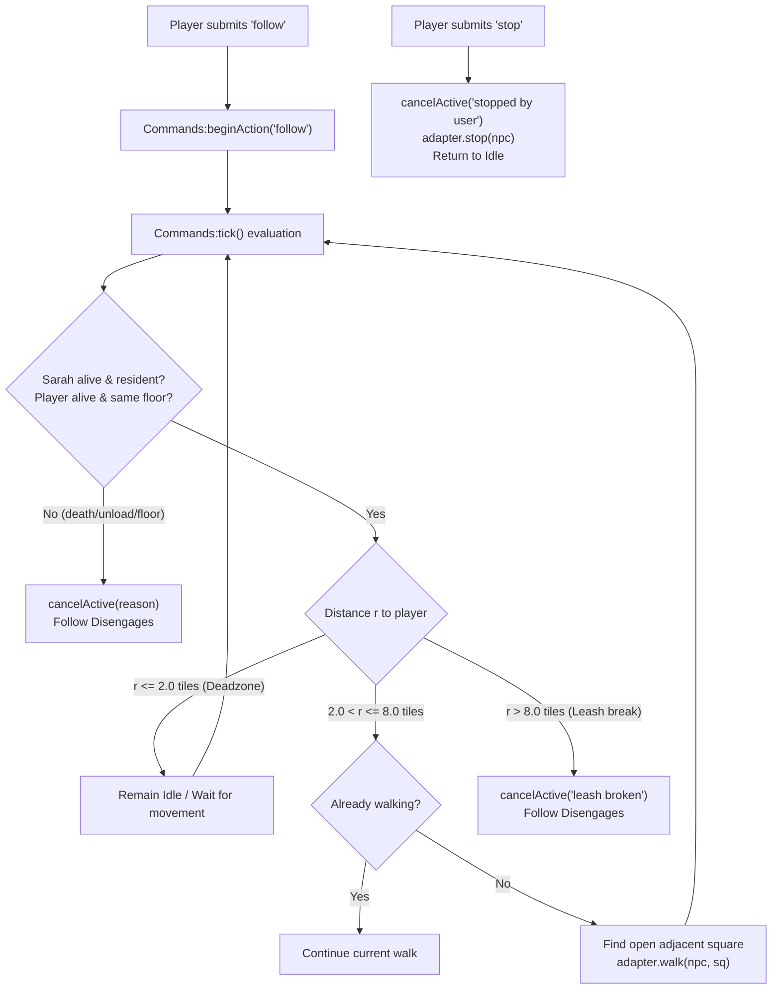

# Project Sarah: Post-M1 Bounded Gameplay Proposal — Manual "Follow Player" Command

Updated: 2026-10-05 (Europe/Helsinki).
Status: **PROPOSAL ONLY** (Drafted for Codex and user review; **NOT** approved or authorized for implementation; M1 native acceptance gates R1–R8 remain pending).
Offline verification baseline: **153 automated checks pass across 6 suites** (`tools/run_tests.py`), **11 runner self-tests pass** (`tools/test_runner.py`), and **19 preflight tests pass** (`tools/test_preflight.py`).

> [!IMPORTANT]
> **Policy & Safeguards Notice**:
> 1. **Do not implement yet**: This document is an architectural and operational proposal only. No gameplay or production code has been modified.
> 2. **Strict M1 Dependency**: Implementation must **not** begin until all remaining M1 native acceptance gates (R1–R8 in `docs/M1-batched-acceptance.md`) pass natively in Codex with verified logs.
> 3. **External AI On Hold**: The external AI layer remains strictly **ON HOLD** by explicit user directive. No LLMs, dialogue systems, or background autonomous agents are proposed.
> 4. **No Broad PZNS Modernization**: Unmodified PZNS is incompatible with Build 42.21.0. This feature builds exclusively on Sarah's minimal, verified foundation (`Commands.lua`, `Engine.lua`, `Lifecycle.lua`).

---

## 1. Executive Summary & Observable Player Benefit

### 1.1 The Gameplay Problem
In M1 Slice C, the player can command Sarah to move using `walk here` (via console typing, toolbar mouse button, or world right-click menu). However, `walk here` is a one-shot target action:
- Sarah paths to the square where the player was standing when the command was issued.
- If the player continues exploring a house, warehouse, or base, Sarah stays behind at that square.
- Moving Sarah across a building requires constant, tedious micro-management: the player must repeatedly stop, trigger `walk here`, wait for Sarah to catch up, move forward a few paces, and repeat.

### 1.2 Observable Player Benefit
A manual `follow` command introduces companion navigation without autonomy or micro-management:
1. **Engagement**: The player opens Sarah Console and submits `follow` (by typing or clicking a `[Follow]` shortcut button) or selects `Sarah: follow` from the world context menu.
2. **Dynamic Companion Movement**:
   - As the player walks around on the same floor, Sarah automatically detects that the player has moved beyond a comfortable distance (inner deadzone of ~2 tiles) and paths to an open square adjacent to the player.
   - When the player stops, Sarah catches up, halts within ~2 tiles, and stands comfortably idle without pushing into the player.
   - When the player resumes walking, Sarah resumes following.
3. **Immediate Disengagement**:
   - Submitting `stop` (typed, toolbar button, or context menu) immediately halts Sarah's physical movement mid-stride and exits follow mode. Sarah remains stationary until the next command.
4. **Predictable Bounded Safeguards**:
   - If the player sprints away or runs beyond an 8-tile leash limit, Sarah does not embark on unbounded pathfinding across the map; follow cleanly disengages with feedback (`Player out of range (>8 tiles); follow disengaged.`).
   - If the player changes floors (e.g. climbs stairs), follow immediately disengages (`Player changed floors; follow disengaged.`).

---

## 2. Minimal Implementation Scope (Architecture & Simplicity)

### 2.1 Why PZNS Companion Job Failed in Build 42
In unmodified PZNS (`vendor/PZNS/PZNS_Framework/media/lua/client/07_npc_ai/PZNS_JobsCompanion.lua`), companion following was bundled into a heavy, monolithic subsystem that included:
- Continuous clearing of native action queues every 30 ticks (`PZNS_ClearQueuedNPCActions`), causing animation jerking and pathfinder crashes.
- Unverified vehicle boarding and passenger logic (`jobCompanion_EnterCar`, `PZNS_ExitVehicle`).
- Sneaking synchronization, weapon aiming manipulation, and combat interrupts (`PZNS_IsNPCBusyCombat`).
- Automatic door opening and closing during movement (`tempdoor:ToggleDoor`), causing desynchronization and clipping through locked doors.
- Random tile offsets (`ZombRand(1, CompanionFollowRange)`), causing erratic routing and collisions.

### 2.2 Sarah's Minimal Bounded Follow Architecture
Sarah avoids all job framework overhead. Follow is implemented purely as a sustained mode within the existing command dispatcher:
- **No new classes or background threads**: Follow is managed inside `Commands.lua` under `self.active.command == 'follow'`.
- **One active action token**: While follow is engaged, `self.active` holds the follow session token. Concurrent commands (like `walk here`) are rejected with `busy` until follow is stopped.
- **Tick-driven evaluation**: `Commands:tick()` evaluates player distance and lifecycle state on a throttled interval (e.g. every 20–30 game ticks, or whenever an active sub-walk completes):
  - If Sarah is currently idle and the player is beyond the inner deadzone, `Commands` invokes a discrete `adapter.walk` sub-action towards an open square adjacent to the player.
  - When the sub-walk finishes (onSuccess or onFail), Sarah returns to idle within follow mode and waits for the player to move again.
- **Direct stop integration**: When `stop` is issued, `Commands:cancelActive('stopped by user')` immediately cancels both the active sub-walk and the parent follow mode, invoking `adapter.stop(npc)`.



---

## 3. Reuse of Existing Movement, Validation, and Cancellation

The follow proposal requires **zero changes** to `Engine.lua` and **zero changes** to native PZ action classes. It reuses existing, tested M1 building blocks:

| Component | Module | Existing Functionality Reused |
|---|---|---|
| **Action Queue & Timed Action** | `Engine.lua` | Reuses `Engine.SarahWalkAction` (derived from native `ISWalkToTimedAction`) added via `ISTimedActionQueue.add(act)`. |
| **Path Cancellation** | `Engine.lua` | Reuses `adapter.stop(npc)`: executes `ISTimedActionQueue.clear(npc)`, `getPathFindBehavior2():cancel()`, and `setPath2(nil)`. |
| **Target Validation** | `Engine.lua` | Reuses `adapter.validateTarget(npc, target)`: checks floor equality, loaded square, maximum 8-tile radius, and walkable/free tile (`sq:isFree(false)`). |
| **Lifecycle & Identity** | `Commands.lua` | Reuses `self:checkLifecycle()`, `self:getIdentity()`, private identity provider `{controller, npc}`, and action token validation. |
| **Public Observations** | `Observations.lua` | Reuses handle-free `Observations.read(controller, player, false)` for distance and coordinate sampling without exposing mutable Java references. |
| **Console & Toolbar** | `Console.lua` | Reuses existing command dispatch, output scrolling, history listbox, and shortcut toolbar (can add `[Follow]` button if desired or accept typed command). |

---

## 4. Geometry, Distance Boundaries, and Travel Suspension

### 4.1 Inner Deadzone ($r \le 2.0$ tiles)
- **Problem**: In PZ, a tile occupied by the local player is not free (`square:isFree(false)` returns `false`). If Sarah paths directly to the player's coordinate ($r = 0$), pathfinding fails or Sarah pushes into the player's collision volume. Additionally, continuous repathing while the player is standing still causes frame stutter and character jitter.
- **Policy**: An inner deadzone radius of $r_{inner} = 2.0$ tiles ($dx^2 + dy^2 \le 4.0$).
- **Behavior**: When Sarah is within 2 tiles of the player on the same floor, no new walk action is dispatched. If Sarah was walking and reaches this radius, she finishes her step and rests in an idle state.

### 4.2 Repath Band ($2.0 < r \le 8.0$ tiles)
- **Policy**: When the Euclidean distance between Sarah and the player exceeds 2.0 tiles but remains $\le 8.0$ tiles, Sarah repaths.
- **Target Selection**: Sarah does not target the player's exact square. Instead, the dispatcher iterates adjacent neighbor squares to the player:
  $$\{(x+1, y), (x-1, y), (x, y+1), (x, y-1), (x+1, y+1), (x-1, y-1), (x+1, y-1), (x-1, y+1)\}$$
  The first adjacent square that passes `adapter.validateTarget(npc, candidate)` is chosen as the path destination.
- **Throttling**: Path recalculation is throttled to occur only when:
  1. Sarah is idle (previous sub-walk arrived or finished), OR
  2. The player has moved $> 1.5$ tiles away from Sarah's current path destination, and at least 20 game ticks have elapsed since the last path command.

### 4.3 Leash Limit ($r > 8.0$ tiles)
- **Problem**: If the player sprints down a long road or drives off in a vehicle, attempting to follow across long distances strains pathfinding, risks encountering unloaded chunks, and violates the 8-tile safety boundary established in M1.
- **Policy**: Strict 8-tile leash limit ($dx^2 + dy^2 > 64.0$).
- **Behavior**: If the distance exceeds 8 tiles, follow mode **fails closed**. The action is cancelled with `cancelActive('Player out of range (>8 tiles); follow disengaged.')`. Sarah immediately stops where she is and awaits a new manual command.

### 4.4 Floor Boundaries ($sz \neq tz$)
- **Problem**: Multi-floor navigation (stairs) in PZ Build 42.21.0 is known to produce pathing failures, stuck loops, and character falling. Furthermore, M0 hardening notes explicitly document that multi-floor rendering and visibility remain unverified.
- **Policy**: Strict same-floor requirement (`math.floor(sz) == math.floor(tz)`).
- **Behavior**: If the player changes floors (e.g. climbs a staircase), follow mode disengages immediately with `cancelActive('Player changed floors; follow disengaged.')`.

### 4.5 Interaction with M0 Travel Suspension ($r > 32$ tiles)
- In M0, `adapter.shouldUnload(npc)` unloads Sarah to a saved binary checkpoint when the player moves $> 32$ tiles away (`Lifecycle:maintain()`).
- Because follow mode disengages at 8 tiles, Sarah will already be in an idle, stationary state long before the player reaches 32 tiles.
- When the player travels beyond 32 tiles, M0 travel suspension unloads Sarah safely without interference from follow mode.
- If the player returns to Sarah's saved location, M0 restores her in the normal idle state.

---

## 5. Lifecycle, Teardown, and Save/Reload Behavior

Follow mode is strictly **ephemeral and in-memory**:

| Event | System Behavior |
|---|---|
| **Sarah Death** | Detected via `OnPlayerDeath` or `checkLifecycle()`. `cancelActive('dead')` terminates follow immediately. Tombstone persists; no resurrection. |
| **Player Death** | Detected via `observe()`. `cancelActive('player dead')` terminates follow immediately. |
| **Unload / Travel** | `checkLifecycle()` detects `state ~= 'active'`. `cancelActive(state)` terminates follow. |
| **Controller Replacement** | `checkLifecycle()` detects controller or NPC instance mismatch. `cancelActive('controller replaced')` terminates follow. |
| **Manual Stop Command** | User types `stop` or clicks `[Stop]`. `cancelActive('stopped by user')` clears action queue and halts movement immediately. |
| **Quit to Main Menu** | `Commands:reset()` executes during `Events.OnMainMenuEnter`. Cancels active follow, increments session token, clears history. |
| **Save / Reload** | Follow state is **NEVER** serialized to disk or saved in `.bin` checkpoints. Upon loading a saved world, Sarah is restored at her saved square in an **idle** state. Follow must be explicitly re-issued by the user. |

---

## 6. Failure Modes & Edge Case Handling

1. **Pathfinding Obstacles (Doors, Windows, Barricades)**:
   - If the player enters a room and closes/locks the door, Sarah's pathfinder may report failure (`BehaviorResult.Failed`).
   - The native `SarahWalkAction:stop()` invokes `onFail(action, "path failed")`.
   - Dispatcher behavior: In follow mode, a path failure should not trigger an infinite loop of immediate retries. The dispatcher records the failure in history, halts Sarah, and sets follow to a paused/disengaged state with feedback (`Path to player blocked; follow stopped.`).
2. **Player Enclosed / No Free Adjacent Squares**:
   - If the player is surrounded by furniture or zombies such that all 8 neighbor squares fail `validateTarget`, Sarah does not crash or pick an invalid tile. The evaluation logs `No walkable square near player` and waits or disengages cleanly.
3. **Player Sprinting / Erratic Movement**:
   - Throttling (minimum 20 ticks between repathing) prevents the engine from allocating dozens of path search tasks per second.
4. **Console Input During Follow**:
   - Query commands (`status`, `inventory`, `history`, `help`) work normally while follow is running.
   - `status` reports: `Action: #N follow (running) - following player (distance: X tiles)`.
   - `stop` halts follow immediately.
   - `walk here` is rejected with `busy` while follow is active.

---

## 7. Native PZ API Analysis: Verified vs Unverified

To prevent regressions, the proposal distinguishes verified engine capabilities from dangerous assumptions:

### 7.1 Verified Native APIs (Safe to Use)
- `ISWalkToTimedAction` (installed at `media/lua/client/TimedActions/WalkToTimedAction.lua`): Verified and working via `Engine.SarahWalkAction`.
- `ISTimedActionQueue.add(act)` and `ISTimedActionQueue.clear(character)`: Verified for queuing and mid-stride cancellation.
- `character:getPathFindBehavior2():cancel()` and `character:setPath2(nil)`: Verified for terminating physical movement.
- `square:isFree(false)`: Verified for checking tile occupancy and walkability.
- `getCell():getGridSquare(x, y, z)`: Verified for retrieving loaded map tiles.
- `getSpecificPlayer(0)`: Verified for retrieving local player coordinates.

### 7.2 Unverified / Dangerous APIs (Strictly Excluded)
- `PZNS_JobCompanion`: Highly bugged in Build 42.21.0; completely excluded.
- `IsoPlayer:setSneaking()`: Synchronization of stance is unverified in B42 and risks animation locks; excluded.
- `PZNS_EnterVehicleAsPassenger`: Vehicle boarding is completely unverified for NPCs in Build 42; excluded.
- `PZNS_IsNPCBusyCombat`: Combat integration is deferred; Sarah does not participate in combat.
- `tempdoor:ToggleDoor()`: Automatic door opening during walks is unverified and risks clipping; excluded.
- Teleportation / direct coordinate overrides (`setX`, `setY`): Strictly prohibited; Sarah must physically navigate using native pathfinding.

---

## 8. Hard Dependencies on Remaining M1 Native Gates

Implementation of the follow feature **must be blocked** until the remaining M1 native acceptance gates (documented in `docs/M1-batched-acceptance.md`) pass natively in an isolated test run by Codex:

| Gate | Requirement for Follow Feature |
|---|---|
| **Gate R1** (Movable Console) | **Essential**: The player must be able to drag the console aside so they can visually observe Sarah following them around the room. |
| **Gate R2** (Control Click Isolation) | **Essential**: Ensures clicking `[Stop]` or toolbar buttons during follow never drags the panel or drops inputs. |
| **Gate R3** (Position Retention) | Ensures console stays where placed while observing follow behavior. |
| **Gate R4** (Resolution Adaptation) | Ensures UI remains accessible during testing at various window sizes. |
| **Gate R5** (Distance Refusal) | **Essential**: Directly validates the 8-tile boundary checking logic that the follow leash relies upon. |
| **Gate R6** (Red Context Menu Refusal) | Confirms error feedback paths are working natively. |
| **Gate R7** (Post-Reload WASD Movement) | **Essential**: Confirms that player movement controls remain functional after reloads, which is mandatory for testing follow. |
| **Gate R8** (Session Reset) | **Essential**: Confirms that session teardown cleanly clears state and history. |

---

## 9. Verification & Acceptance Strategy

### 9.1 Offline Automated Test Suite (Lupa Fixtures)
Before any native testing, add dedicated unit tests in `tools/test_commands.py`:
1. `test_follow_command_parsing`: Verify `follow` command is recognized and recorded in history.
2. `test_follow_busy_rejection`: Verify issuing `walk here` while `follow` is active returns `rejected (busy)`.
3. `test_follow_deadzone_idle`: Verify that when player is within 2 tiles on the same floor, no walk action is dispatched.
4. `test_follow_repath_dispatch`: Verify that when player moves to 4 tiles away, an `adapter.walk` sub-action is queued targeting an adjacent square.
5. `test_follow_leash_disengagement`: Verify that when player distance exceeds 8 tiles, follow mode cancels with `Player out of range`.
6. `test_follow_floor_change_disengagement`: Verify that when player $z$ changes, follow mode cancels immediately.
7. `test_follow_stop_cancellation`: Verify that `stop` command immediately cancels active follow mode and invokes `adapter.stop`.
8. `test_follow_lifecycle_invalidation`: Verify that death or unload of Sarah or player cancels follow mode immediately.
9. `test_follow_session_reset`: Verify that `Commands:reset()` resets follow state and increments session token.

### 9.2 Native Live Acceptance Protocol (Codex + User)
Executed in the isolated `SarahSpaciousCase` sandbox world (zero zombies):
1. **Activation**: Open Sarah Console, submit `follow`. Verify console reports `#N running: Following player`.
2. **Short Walk & Deadzone**:
   - User walks player forward 4 tiles and stops.
   - Observe Sarah physically paths toward the player and stops ~2 tiles away.
   - Verify Sarah stands idle and does not push into the player or jitter.
3. **Turn & Repath**:
   - User walks around a pillar or furniture item.
   - Observe Sarah paths around the obstacle and catches up to ~2 tiles.
4. **Mid-Stride Stop**:
   - User walks forward 6 tiles; while Sarah is moving, Codex clicks `[Stop]`.
   - Verify Sarah halts immediately mid-stride and history reports `#N completed: Sarah stopped`.
   - User walks away; verify Sarah remains stationary and does not follow.
5. **Leash Break**:
   - Re-engage `follow`.
   - User sprints away $> 10$ tiles.
   - Observe Sarah halts at the 8-tile boundary and console reports disengagement. No errors in console log.
6. **Floor Change**:
   - Re-engage `follow`.
   - User climbs a staircase to floor 1.
   - Observe follow disengages cleanly as soon as player leaves floor 0. Sarah remains safely on floor 0.

---

## 10. Ready-to-Copy Implementation Prompt for Codex Review

When M1 native acceptance is completed and the user explicitly authorizes post-M1 coding, the following prompt can be used to direct implementation:

```text
Implement bounded post-M1 manual follow-player command for Project Sarah from docs/M1-next-feature-proposal.md.

Context & Rules:
- Read AGENTS.md, docs/STATUS.md, docs/ROADMAP.md, and docs/M1-next-feature-proposal.md.
- Confirm that M1 native acceptance gates R1–R8 have passed before editing code.
- External AI remains strictly ON HOLD. Do not implement any LLM or external AI layer.
- Keep installed game files and normal profile strictly read-only.
- Implement only the bounded 'follow' command in Commands.lua (and optional shortcut in Console.lua).
- Reuse existing Engine.SarahWalkAction, adapter.walk, adapter.stop, and adapter.validateTarget. Do not create new action classes or job managers.

Requirements:
1. Commands.lua:
   - Add 'follow' command to execute().
   - Maintain active follow state in self.active (command = 'follow').
   - In self:tick(), throttle distance evaluation (every 20-30 ticks or when idle).
   - Inner deadzone: if player within 2.0 tiles, remain idle (no walk dispatched).
   - Repath: if player 2.0 < r <= 8.0 tiles, find free adjacent tile to player and dispatch adapter.walk.
   - Leash break: if r > 8.0 tiles, cancelActive('Player out of range (>8 tiles); follow disengaged.').
   - Floor limit: if player floor ~= npc floor, cancelActive('Player changed floors; follow disengaged.').
   - Lifecycle: cancelActive immediately on death, unload, or controller/npc replacement.
   - Stop integration: user 'stop' command cancels follow immediately and halts engine walking.
   - Volatile: follow state is never persisted across save/reload or session reset.
2. Console.lua (Optional UI convenience):
   - Add 'follow' to help command text.
   - Optionally add [Follow] toolbar button if layout permits, or rely on typed command.
3. Tests:
   - Add offline unit tests in tools/test_commands.py covering: parsing, busy rejection, deadzone idle, repath dispatch, leash break (>8 tiles), floor change, stop cancellation, lifecycle invalidation, and session reset.
   - Ensure all existing and new checks pass via tools/run_tests.py, test_runner.py, and test_preflight.py.
4. Update STATUS.md and HANDOFF.md, commit, and push.
```
